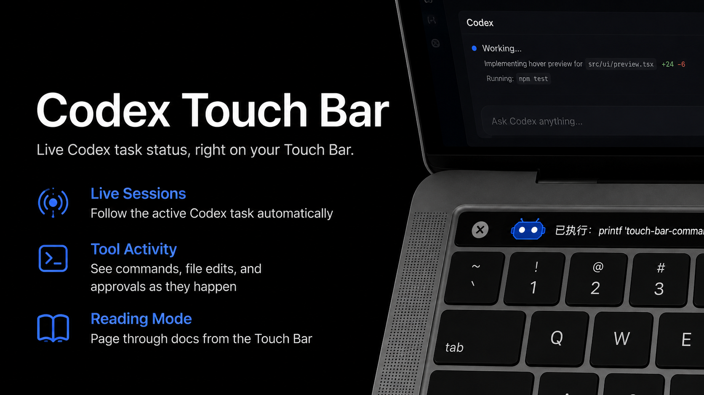

# Codex Touch Bar



语言: [English](README.md) | 简体中文

Codex Touch Bar 是一个 macOS 状态栏应用，用于把 Codex 当前会话、智能体回复、工具调用、审批等待、完成状态和轻量阅读模式显示到 MacBook Pro 的 Touch Bar 上。

项目面向带实体 Touch Bar 的 MacBook Pro，例如 13 英寸 MacBook Pro M2。应用以状态栏形式运行，不显示 Dock 图标。

## 截图

### 运行中


### 等待审批


### 已完成


## 功能

- Codex 会话显示：自动读取 `~/.codex/sessions` 下的 Codex JSONL 会话文件，并显示最新用户消息、助手回复和工具活动。
- 自动跟随：默认使用 `AUTO` 模式，跟随最近活跃的主 Codex 会话。
- 手动锁定会话：点击 Touch Bar 左侧宠物入口展开会话列表，可切换到指定会话；列表支持左右滑动。
- 状态宠物：用简约机器人宠物表示会话状态，包括空闲、运行中、等待审批、完成、失败和阅读模式。
- 正文显示：支持滚动和翻页两种显示方式。用户点击或滑动当前正文后，会暂停该条正文的自动滚动或自动翻页；下一条正文出现后恢复自动逻辑。
- 审批提示：当 Codex 等待工具调用审批时，Touch Bar 会显示审批信息，宠物切换为等待审批颜色。
- 打开当前会话：状态栏菜单和 Touch Bar 右侧入口都可以打开当前 Codex 会话。
- 手动闲置：任务完成后可点击闲置入口，让当前显示回到空闲文案。
- 完成提示：任务完成时支持提示音效。
- 完成朗读：可在状态栏菜单中开启或关闭完成后的自动朗读，并选择系统语音、语速和音调。
- 阅读模式：可从状态栏选择文本文件进入夜读模式，支持 TXT、Markdown、Word 文档以及常见代码文件。
- 阅读进度：保存最近阅读文件和页码，支持继续阅读、自动翻页速度设置和段落跳转。

## Touch Bar 布局

Codex 会话模式：

```text
宠物/会话入口 | 正文内容 | 打开当前会话 | 闲置
```

阅读模式：

```text
自动翻页 | 上一页 | 正文内容 | 下一页 | 段落选择
```

空闲文案：

- `AUTO · 暂无进行中的任务`
- `<项目名> · 暂无进行中的任务`

## 状态栏菜单

菜单按用途分为几组：

- Codex 会话：当前会话、当前项目、打开当前会话、完成朗读、语音、语速、音调。
- 阅读：当前阅读文件、文件路径、阅读进度、打开文件、继续阅读、退出阅读模式、自动翻页速度。
- Touch Bar：常驻 Touch Bar 开关、正文显示方式。
- 通用：暂停更新、立即刷新、退出。

## 智能体安装

AI 编程智能体可以按下面步骤从全新仓库克隆、打包、安装到应用程序目录并启动：

```bash
git clone https://github.com/xbos1314/codex-touch-bar.git
cd codex-touch-bar
swift build
./scripts/package-app.sh
osascript -e 'tell application "Codex Touch Bar" to quit' 2>/dev/null || true
ditto "dist/Codex Touch Bar.app" "/Applications/Codex Touch Bar.app"
open "/Applications/Codex Touch Bar.app"
```

## 构建和运行

项目使用 SwiftPM：

```bash
swift build
```

打包为 macOS `.app`：

```bash
scripts/package-app.sh
open "dist/Codex Touch Bar.app"
```

安装到应用程序目录：

```bash
ditto "dist/Codex Touch Bar.app" "/Applications/Codex Touch Bar.app"
open "/Applications/Codex Touch Bar.app"
```

验证签名：

```bash
codesign --verify --deep --strict "dist/Codex Touch Bar.app"
```

## 项目结构

```text
Sources/CodexTouchBarApp/       macOS AppKit 状态栏应用和 Touch Bar 控制
Sources/CodexTouchBarCore/      会话解析、状态归约、显示策略和设置
assets/screenshots/             README 截图
Packaging/                      Info.plist 和应用图标
scripts/package-app.sh          SwiftPM 构建和 .app 打包脚本
```

## 已知限制

- Codex 内容读取依赖本机 `~/.codex/sessions` JSONL 文件，显示会有轻微延迟。
- Control Strip 常驻入口依赖 macOS 私有 Touch Bar 行为，系统升级后可能需要调整。
- 当前应用只显示和打开 Codex 会话，不直接向 Codex 会话发送回复。
- 实体 Touch Bar 效果需要在目标 MacBook Pro 上人工确认。

## 开发备注

- App 打包入口是 `scripts/package-app.sh`。
- 正文清洗逻辑集中在 `Sources/CodexTouchBarCore/CodexDisplayTextFormatter.swift`。
- 阅读 Markdown 清洗逻辑集中在 `Sources/CodexTouchBarCore/ReadingMarkdownTextFormatter.swift`。
- Touch Bar 状态宠物绘制逻辑集中在 `Sources/CodexTouchBarCore/TouchBarRobotPetDrawingPolicy.swift`。

## 许可证

MIT。详见 [LICENSE](LICENSE)。
